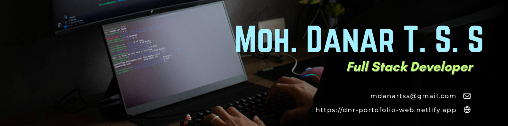

  

# Hi, I'm Mohammad Danar Tri Setio Suntoro! 👋

I'm an enthusiastic SIJA graduate from SMK Negeri 1 Dlanggu, driven by a curiosity for technology and a love of tech stories. My journey involves diving into the world of web development, exploring new ideas, and sharing my insights with the community.

## 🚀 About Me

- 🔭 I'm currently learn the latest industry-standard programming skills in dumbways.
- 🌐 Proud member of the [Dumbways.id](https://dumbways.id/)

### 🚀 My Tech Stack

#### **Frontend & Mobile**

#### **Backend & Database**

#### **Tools**

## 🌱 Currently Exploring

- 📱 Learning Mobile App Development
  - Exploring Flutter to build beautiful, high-performance, natively compiled applications for mobile (Android).
    
- 🚀 Learning Full Stack Web Development
  - Exploring the ins and outs of React and Redux for dynamic front-end experiences.
  - Navigating through the world of React Router for seamless page transitions.
  - Styling with Tailwind CSS to create modern and responsive user interfaces.
  - Building server-side applications with Express, a fast, minimalist Node.js web framework.
  - Diving into PostgreSQL for efficient and scalable database management.

## 📬 Get in Touch

- Connect with me on [LinkedIn](https://www.linkedin.com/in/mohammad-danar-tri-setio-suntoro), [Instagram](https://www.instagram.com/daantrifad/), [Github](https://github.com/DANAR-sft)
- See more about me on [personal web](https://dnr-portofolio-web.netlify.app)

Thanks for stopping by! Let's connect and explore the fascinating world of technology together. 🚀

<!--

Here are some ideas to get you started:

- 🔭 I’m currently working on ...
- 🌱 I’m currently learning ...
- 👯 I’m looking to collaborate on ...
- 🤔 I’m looking for help with ...
- 💬 Ask me about ...
- 📫 How to reach me: ...
- 😄 Pronouns: ...
- ⚡ Fun fact: ...
-->
