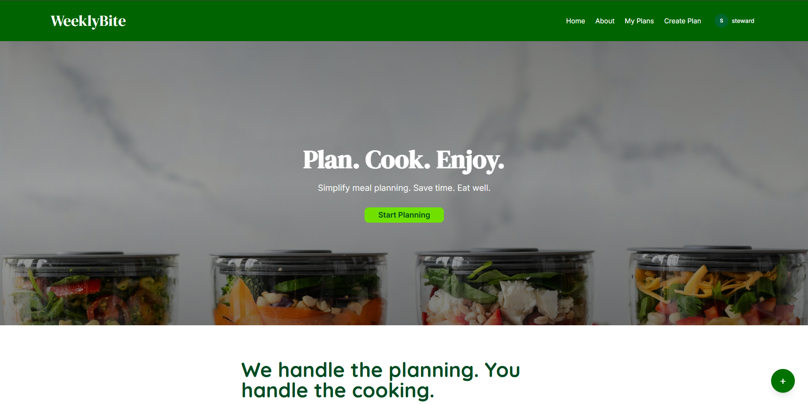
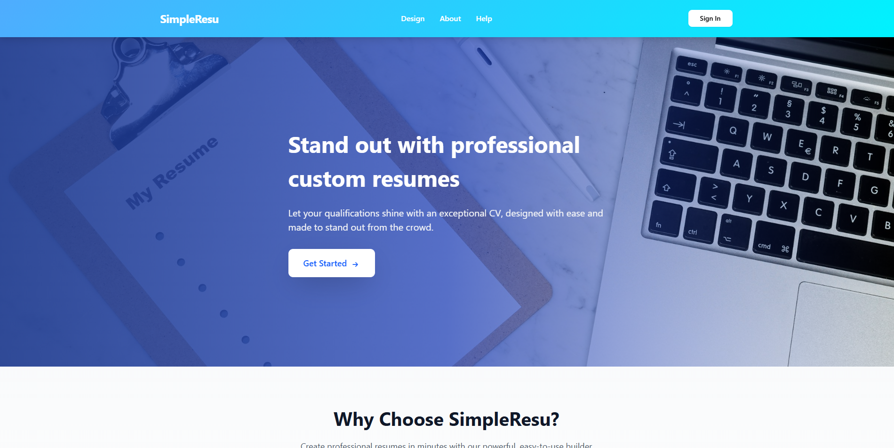
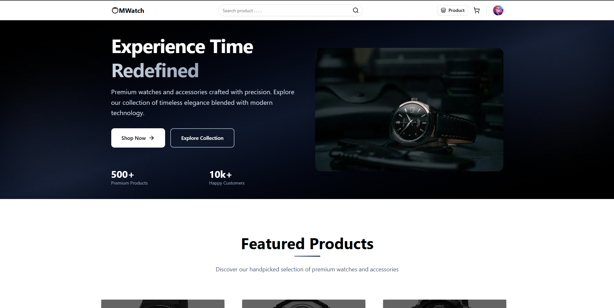
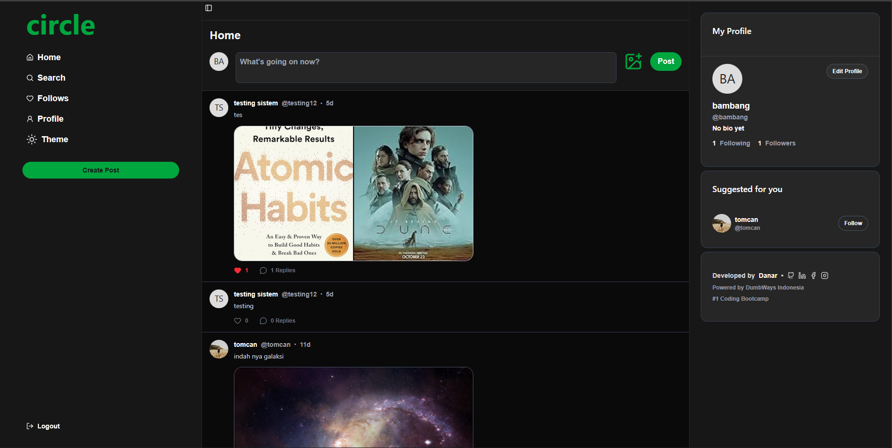
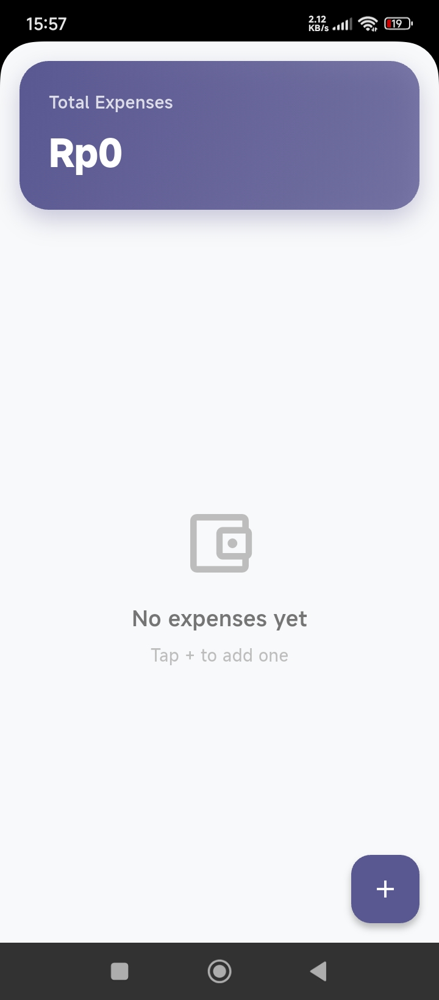

  

# Mohammad Danar Tri Setio Suntoro | Full-Stack Developer | React.js, Next.js, Node.js & Flutter | Crafting clean and responsive web & mobile applications

Graduating from vocational school (SMK) was a significant wake-up call for me. The tech world, I discovered, operates at a pace far removed from the academic setting. A year spent fumbling through things solo made it clear I needed a significant push to advance truly. So, I took the plunge and signed up for the Full-Stack Developer bootcamp at Dumbways.

My aim was straightforward, yet ambitious, to transition from student to professional. I wasn't just looking to learn to code, I wanted to understand how to build systems that genuinely address real-world issues.

During the bootcamp, I spent many late nights wrestling with JavaScript, React, and building mobile apps using Flutter. I learned firsthand the frustration of debugging at 11 PM, and the immense satisfaction of finally getting intricate logic to function flawlessly. This experience led to several projects, including SimpleResu, which taught crucial lessons about clean code and the value of collaboration.

Looking back, it's clear that being a developer goes beyond rote memorization, it's about how swiftly you can adapt and absorb new information. I'm now invigorated and eager to bring that passion, along with my technical abilities, to a dynamic team. I'm looking for a chance to contribute, keep learning, and develop alongside a great company.

## 🚀 About Me

- 🔭 I'm currently learn the latest industry-standard programming skills in dumbways.
- 🌐 Proud member of the [Dumbways.id](https://dumbways.id/)

### 🛠️ Tech Stack & Tools

| Category | Technologies |
| :--- | :--- |
| **Frontend & Mobile** |      |
| **Backend & Database** |       |
| **Tools & Others** |    |

### 🚀 Featured Projects

<table>
  <tr>
    <td width="50%" valign="top">
      
      <h3>🥗 Weekly Bite (AI Meal Planner)</h3>
      
A web app using Google Gemini AI to generate 7-day meal plans based on calories, macros, and allergies.

      
<b>Stack:</b> Next.js, Gemini AI API, Tailwind CSS, Supabase, shadcn/ui, Typescript.

      
<b>Feature:</b>

      <ul>
        <li>Authentication</li>
        <li>Create plan</li>
        <li>Plan Management</li>
        <li>Ingredients list</li>
        <li>Swap meal</li>
        <li>Download ingredients list in PDF</li>
      </ul> 
      <a href="https://github.com/DANAR-sft">🔗 Source Code</a> | <a href="https://weekly-bite-two.vercel.app/">💻 Live Demo</a>
    </td>
    <td width="50%" valign="top">
      
      <h3>📝 SimpleResu (Resume Builder)</h3>
      
A professional resume builder with a step-by-step flow and PDF export features.

      
<b>Stack:</b> Next.js,
        Tailwind CSS,
        shadcn/ui,
        Supabase,
        Express.js,
        Prisma.

      
<b>Feature:</b>

      <ul>
        <li>Authentication</li>
        <li>Create resume</li>
        <li>Choose design template</li>
        <li>Resume Customize</li>
        <li>live preview</li>
        <li>Resume management</li>
        <li>Download Resume in PDF</li>
      </ul>
      <a href="https://github.com/DANAR-sft">🔗 Source Code</a> | <a href="https://simpleresu.netlify.app/">💻 Live Demo</a>
    </td>
  </tr>
  <tr>
    <td width="50%" valign="top">
      
      <h3>⌚ MWatch (Mini Store)</h3>
      
E-commerce web store with real-time cart management, admin dashboard, and payment gateway.

      
<b>Stack:</b> Supabase,
        Next.js,
        TypeScript,
        Tailwind CSS,
        shadcn/ui.

      
<b>Feature:</b>

      <ul>
        <li>Authentication</li>
        <li>Product list</li>
        <li>Product filter</li>
        <li>User order tracking</li>
        <li>Cart product</li>
        <li>Payment gateaway</li>
        <li>Realtime update</li>
        <li>Admin product management & monitoring</li>
        <li>Admin order tracking & monitoring</li>
      </ul>
      <a href="https://github.com/DANAR-sft">🔗 Source Code</a> | <a href="https://mwatch-mini-store.vercel.app/">💻 Live Demo</a>
    </td>
    <td width="50%" valign="top">
      
      <h3>🤝 Circle (Social Media App)</h3>
      
Modern social media app featuring user authentication, threads, replies, and real-time interactions.

      
<b>Stack:</b> React.js,
        TypeScript,
        Express.js,
        Prisma,
        PostgreSQL,
        Tailwind CSS,
        shadcn/ui.

      
<b>Feature:</b>

      <ul>
        <li>Authentication</li>
        <li>Create Thread</li>
        <li>Profile Customize</li>
        <li>Search</li>
        <li>Follow & Unfollow</li>
        <li>Realtime thread update</li>
        <li>Dark & light Theme</li>
        <li>Reply & like thread</li>
      </ul>
      <a href="https://github.com/DANAR-sft">🔗 Source Code</a> | <a href="https://circle-app-frontend-iota.vercel.app/login">💻 Live Demo</a>
    </td>
  </tr>
  <tr>
    <td width="50%" valign="top">
      
      <h3>📱 Personal Expense Tracker</h3>
      
Mobile application to track user expenses by manually adding and categorizing.

      
<b>Stack:</b> Flutter, Dart, Android Studio.

      
<b>Feature:</b>

      <ul>
        <li>Form for adding expense by category</li>
        <li>Expense list</li>
        <li>Expense Calculation</li>
        <li>Expense delete</li>
      </ul>
      <a href="https://github.com/DANAR-sft">🔗 Source Code</a> | <a href="https://drive.google.com/file/d/1TeM-RBmK4X-6tO-Yip2pOI2FiOB8LzXQ/view">📲 Download APK</a>
    </td>
    <td width="50%">
      </td>
  </tr>
</table>

## 🌱 Currently Exploring

- 📱 Learning Mobile App Development
  - Exploring Flutter to build beautiful, high-performance, natively compiled applications for mobile (Android).
    
- 🚀 Learning Full Stack Web Development
  - Exploring the ins and outs of React and Redux for dynamic front-end experiences.
  - Navigating through the world of React Router for seamless page transitions.
  - Styling with Tailwind CSS to create modern and responsive user interfaces.
  - Building server-side applications with Express, a fast, minimalist Node.js web framework.
  - Diving into PostgreSQL for efficient and scalable database management.

## 📬 Let's Connect

- Connect with me on [LinkedIn](https://www.linkedin.com/in/mohammad-danar-tri-setio-suntoro), [Instagram](https://www.instagram.com/daantrifad/), [Github](https://github.com/DANAR-sft)
- See more about me on [personal web](https://dnr-portofolio-web.netlify.app)

Thanks for stopping by! Let's connect and explore the fascinating world of technology together. 🚀

<!--

Here are some ideas to get you started:

- 🔭 I’m currently working on ...
- 🌱 I’m currently learning ...
- 👯 I’m looking to collaborate on ...
- 🤔 I’m looking for help with ...
- 💬 Ask me about ...
- 📫 How to reach me: ...
- 😄 Pronouns: ...
- ⚡ Fun fact: ...
-->
